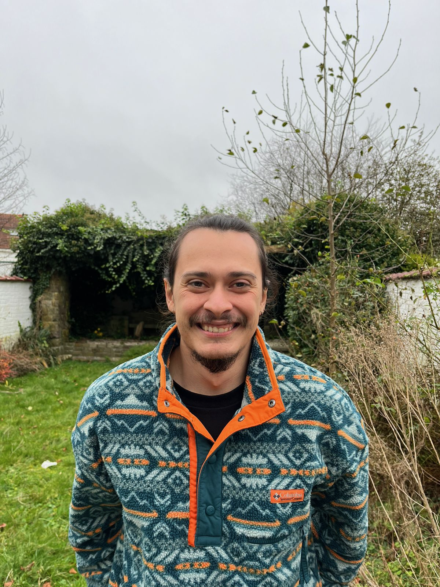

# Welcome to My Portfolio

### About Me
**Name:** Andres Aranguren  
**Email:** [aranguren.andres9712@gmail.com](mailto:aranguren.andres9712@gmail.com)  
**Studies:**  
- **BSc. Biomedical Engineering, Universidad de los Andes, Colombia**  
- **MSc. Data Science, Università degli studi di Padova, Italy**  
- **MSc. Computer Science, University of Leiden, Netherlands (Current)**  

### Summary
I am a Machine Learning Engineer with expertise in computer vision, deep learning, and AI model deployment. My professional background includes developing tailor-made AI solutions in industrial, medical, and agricultural domains. I have successfully led projects involving autoencoder-based models, transformer architectures, and quality inspection tools. Additionally, I excel in collaborative and fast-paced environments, working with diverse teams to deliver impactful results.

### Skills
- **Programming Languages:** Python, JavaScript, TypeScript, R  
- **Frameworks and Tools:** PyTorch, TensorFlow, React, Node, MLflow, Kubernetes  
- **Cloud Platforms:** AWS, Azure  
- **Areas of Expertise:** Computer Vision, Deep Learning, CI/CD, Model Deployment  

### Languages
- **English:** Proficient  
- **Spanish:** Native  
- **Italian:** Native  
- **French:** Proficient  

---

### Contact
Feel free to reach out via [email](mailto:aranguren.andres9712@gmail.com) or connect with me on [GitHub](https://github.com/ArangurenAndres).
