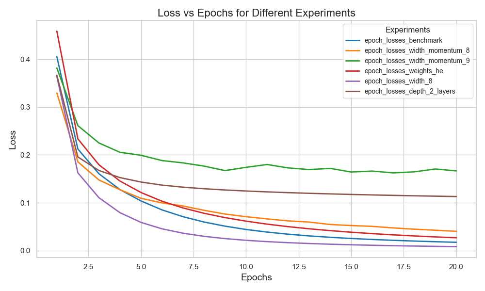

# Advanced Neural Network Derivations and Experiments

You can download the full report with detailed derivations, implementations, and results, including code snippets, here:

[Download PDF](../assets/pdfs/Andres_Aranguren_assignment_2.pdf)

---

### Abstract
This project delves into the mathematical foundations and practical implementations of neural networks, emphasizing backpropagation, activation functions, and architecture optimization. Through a series of theoretical derivations and experimental validations, key insights into the behavior of custom operators, activation functions like ReLU and Sigmoid, and convolutional neural networks (CNNs) were uncovered. By systematically varying hyperparameters and configurations, significant improvements in performance metrics were achieved, demonstrating the critical interplay between theory and experimentation in advancing machine learning systems.

---

### Project Details:
- **Technologies Used**: Python, TensorFlow, PyTorch
- **Methods Implemented**: Backpropagation, Activation Functions, Custom Operators, CNN Architectures
- **Objectives**: The project aimed to explore theoretical derivations, implement and validate neural network components, and optimize architectures and hyperparameters for improved performance.

### Key Highlights:

#### Theoretical Derivations
1. **Element-wise Matrix Division**:
   - Derived backward propagation for the element-wise division of matrices, calculating gradients for both the numerator and denominator using chain and quotient rules.
   - This ensures precise weight updates, critical for custom layer implementations.

2. **General Backpropagation**:
   - Verified that the backward pass involves applying the derivative of activation functions element-wise and multiplying it with the gradient of the loss with respect to the output.
   - Example: Sigmoid derivative \(f'(x) = f(x)(1 - f(x))\), demonstrating its role in the chain rule.

3. **Matrix Multiplication in Layers**:
   - Derived gradients for weights and inputs in linear layers, ensuring alignment with the forward computation \(y = X \cdot W\).
   - Gradients:
     - For weights: 
       \(rac{\partial L}{\partial W} = X^T \cdot rac{\partial L}{\partial y}\)
     - For inputs: 
       \(rac{\partial L}{\partial X} = rac{\partial L}{\partial y} \cdot W^T\).

4. **Custom Normalization Operator**:
   - Derived the backward function for normalizing a vector into a matrix with repeated columns. This included handling contributions from individual elements.

5. **Abstract Operations**:
   - Explored implementation using abstract classes for operations like addition, ensuring consistency and reusability in computational graphs.

#### Comparison of Activation Functions
- **ReLU vs. Sigmoid**:
  - ReLU excelled in mitigating vanishing gradient issues, showing a slight accuracy improvement in early epochs.
  - Sigmoid, while smooth and differentiable, tended to saturate, limiting gradient flow in deeper layers.

| Epochs | Sigmoid Accuracy | ReLU Accuracy |
|--------|------------------|---------------|
| 10     | 96.1%           | 97.3%         |
| 20     | 97.2%           | 97.0%         |

#### Experimental Architectures

**Change the network architecture (and other aspects of the model) and show how the training behavior changes for the MNIST data**

The default configuration of the model consists of two layers. First hidden
layer that applies a linear operation between the inputs and weights followed
by nonlinearity function (Sigmoid or Relu), and a second layer which processes
the output of the first layer, to produce the output which is then transformed
into a probability vector using the softmax function.
hm = hidden-multiplier it specifies the hidden layer size, when increasing hm
we will increase the width of the hidden layer.

To show how the training behaviour changes using different parameters, we can
use the training loss over epochs.

    

The graph describes the loss over epochs for various parameter configurations in
the network. When applying a momentum of 0.9, the performance is reduced
compared to other configurations. A slower convergence, with minimal de-
crease over epochs, could be attributed to the high momentum. This likely
causes a significant portion of the previous update to influence the current
learning step, potentially leading to overshooting the optimal weight updates
and, slower convergence. Similarly, the use of two hidden layers also results
in a slower convergence rate, possibly due to the increased complexity of the
network and the associated challenges in optimizing a deeper architecture. For
the other configurations there is a similar convergence pattern, reaching a after
20 epochs minimum when doubling the hidden multiplier from 4 to 8, which
indicates how many times bigger the hidden layer is than the input layer. This
result suggests that for the given model configuration it is more adequate to in-
crease the width i.e the number of neurons rather than including a second layer
which lowers significantly convergence rate.

We will now explore how 
1. **Hidden Layer Configurations**:
   - Increasing width significantly improved accuracy (e.g., a hidden multiplier of 8 achieved 97.4% vs. 97.2% for default).
   - Adding more layers without tuning reduced performance due to increased complexity and slower convergence.

| Configuration                    | Validation Accuracy |
|----------------------------------|---------------------|
| Default                          | 97.2%              |
| One Hidden Layer (Width = 8)     | 97.4%              |
| Two Hidden Layers (Width = 4)    | 96.0%              |

2. **Weight Initialization**:
   - Random initialization outperformed zeros, showcasing the importance of initial diversity in training.

3. **Momentum Variations**:
   - A momentum of 0.9 accelerated convergence, achieving the highest accuracy of 97.9%.

#### CNN for CIFAR-10
- **Baseline Performance**:
  - A simple CNN with two convolutional layers and ReLU achieved **68.5% test accuracy** on CIFAR-10 after 20 epochs.

- **Optimized Configuration**:
  - Modifications included adding batch normalization and increasing filter sizes.
  - Incorporating a third convolutional layer further improved feature extraction, raising accuracy to **77.2%**.

| Experiment                        | Test Accuracy |
|-----------------------------------|---------------|
| Default (Baseline)                | 68.5%         |
| Batch Normalization + AdamW       | 77.2%         |
| Added Third Convolutional Layer   | 76.4%         |

#### Hyperparameter Tuning
- Experiments with learning rates, batch sizes, and optimizers showed their impact on convergence and final accuracy.
- Highlights:
  - Best accuracy with a learning rate of 0.001, batch size of 16, and AdamW optimizer.
  - Large batch sizes improved stability but required more computational resources.

| Parameter             | Best Value    |
|-----------------------|---------------|
| Learning Rate         | 0.001         |
| Batch Size            | 16            |
| Optimizer             | AdamW         |
| Momentum              | 0.9           |

### Conclusion
This project provided a comprehensive exploration of theoretical and practical aspects of neural networks. By deriving critical mathematical foundations, implementing custom operators, and optimizing model configurations, significant advancements in understanding and performance were achieved. These findings contribute valuable insights for developing more efficient and robust machine learning systems.

[Back to Projects](../projects)
